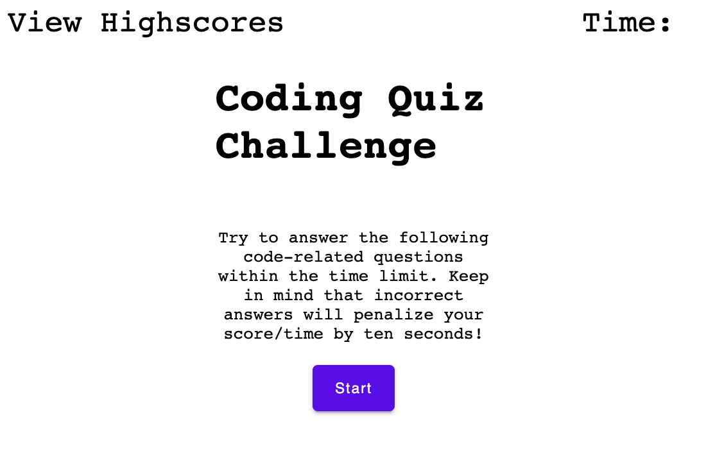

# JavaScript Quiz
## Description
Quiz checking user knowledge of JavaScript. User is present with questions and four answers to select.
Only 1 answer is correct.
Quiz is timed, user has 75 seconds to answer all questions correctly.
If user select wrong answer 10 seconds are substracted from time left, 3 points are substracted from user current score.
When all questions are answered or time is up - user can type initials to save his score on highscores table saved localy.

## Screenshot

## Link
[Click me](https://abstynent.github.io/js-quiz-game)